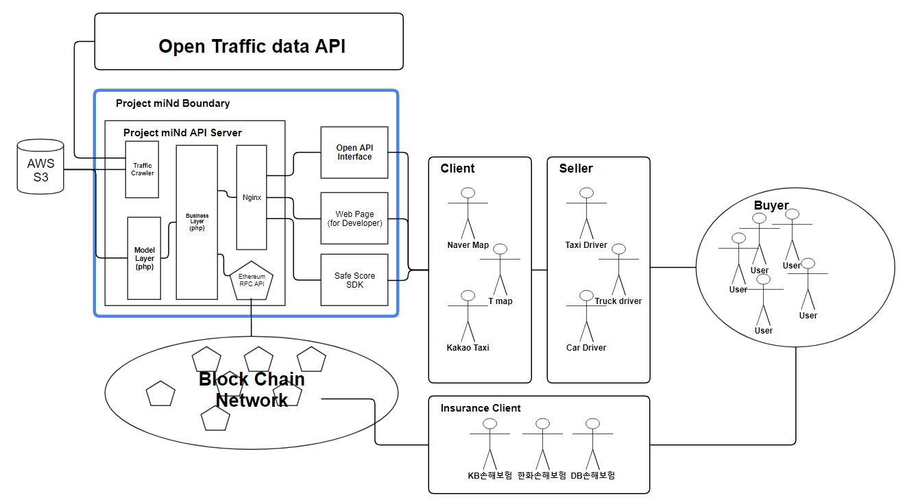

# miNd

* miNd는 이더리움 기반 안전운전 점수 측정 서비스입니다.
* Android의 GPS와 자이로스코프 센서를 이용하여 운전시 급정거 / 급가속 / 과속 / 방지턱 통과시 감속여부 / 신호위반 등을 측정합니다.
* 측정한 정보들의 신뢰성을 보장하기 위해 이더리움을 사용하여 안전점수를 담은 블록을 생성합니다.

### Technical Details
  * 프로젝트 miNd의 기본 적인 서버 구성은 nginx, php, mysql 로 이루어 진다.
  * 해당 서버는 API 서버로 사용될 예정이며, 블록체인 네트워크 연결 부는 geth 이더리움 JSON-RPC를 통해 이더리움 네트워크와 연결한다.
  * 해당 JSON-RPC 프로토콜을 통해 메인 API 서버로 들어온 운행정보를 이용해 안전점수를 측정하여 블록에 저장한다.
  * 위의 프로세스를 제공해주는 SDK를 개발사에게 배포하며, SDK는 Java 기반으로 JVM 위에서 동작하는 플랫폼에 한해 제공된다.
  * 또한 SDK와 함께 API를 공급할 수 있도록 API 개발자 사이트를 React JS를 기반으로 제작하며, Java 기반의 Android Reference 애플리케이션을 제작한다.

### User Guide
 * [User Guide](https://github.com/jyb2605/miNd/blob/master/UserGuide.md)


### System Diagram

```* Project miNd API Server : Open API Interface에서 받아오는 안전운전 점수를 블록을 생성하여 저장
* Open API Interface : 개발사들의 애플리케이션에서 사용자의 운전기록을 Project miNd API Server로 전달
* Web Page(for developer) : 개발사들에게 제공되는 서비스 개발자 페이지
* Safe Score SDK : Client Application에서 운행기록을 안전점수로 가공 가능하게 하는 SDK
* Client : SDK를 탑재한 애플리케이션의 개발사
* Seller : SDK를 탑재한 애플리케이션을 사용하여 서비스를 제공하는 사용자
* Buyer : Seller의 서비스를 구매하는 사용자
* Insurance Client : 블록에 저장된 정보를 취득하여 활용하는 업체
* Block Chain Network : 안전점수 정보를 저장하는 블록체인 네트워크
* AWS S3 : AWS에서 제공하는 데이터베이스 서버
* Open Traffic data API : 교통데이터와 같은 공공 데이터 API
```

### References
  * [도로교통공단](https://www.koroad.or.kr/)
  * [도로교통공단 교통사고 분석시스템 TAAS](http://taas.koroad.or.kr/)
  * [승차공유 서비스 Uber](https://www.uber.com/kr/ko/)
  * [대한민국 정책브리핑](http://www.korea.kr/main.do)


### Members
* 인하대학교 컴퓨터공학과 12131549 안진모
* 인하대학교 컴퓨터공학과 12131581 이하늘
* 인하대학교 컴퓨터공학과 12131610 주완빈
