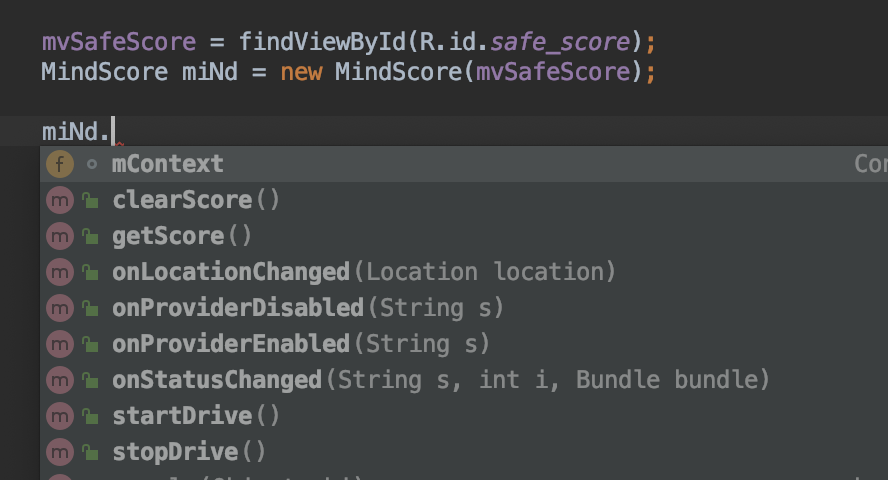

# miNd User Guide

### Method Description

 * startDrive()를 통해 안전점수 측정을 시작할 수 있음
 * stopDrive()을 통해 안전점수 측정을 종료할 수 있으며, 종료 시 측정한 안전점수를 이용하여 Ethereum Block을 생성한다.
 * clearScore()를 통해 안전점수를 초기화 할 수 있음.
 * getScore()를 통해 안전점수를 얻을 수 있음.

### Remarks
 * Default Speed_limit은 현재 60km로 설정되어있음.
 * 60km 이상으로 주행하면 1초에 10점씩 감소하고 있음.
 * 60km 미만으로 주행하면 1초에 2점씩 증가하고 있음.
 * GPS 위치 정보가 바뀌면 onLocationChanged 함수로 기존의 위치와 현재의 위치를 계산하여 속도를 구한다.
 ```
 speed = actual_distance / (mCurrentLocation.getTime() - mLastLocation.getTime());
 ```

### 기타 함수들
 * getDeviceLocation
 * onRequestPermissionsResult
 * buildGoogleApiClient
 * Location.distanceBetween
